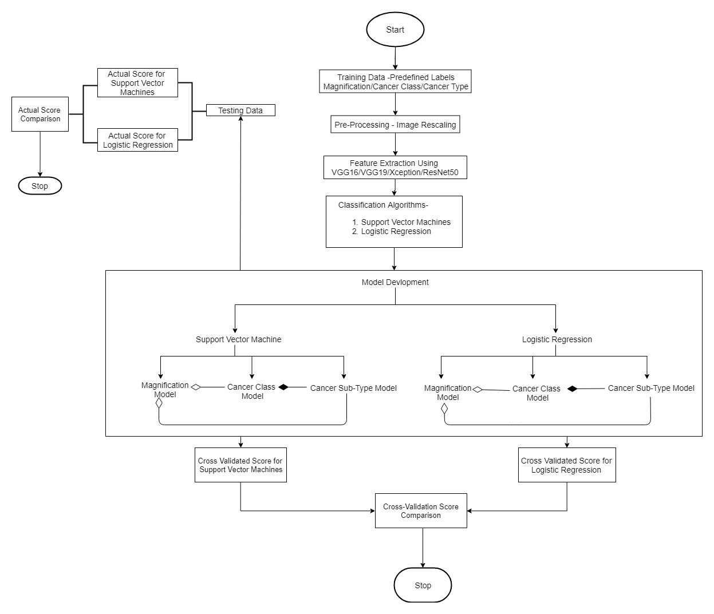
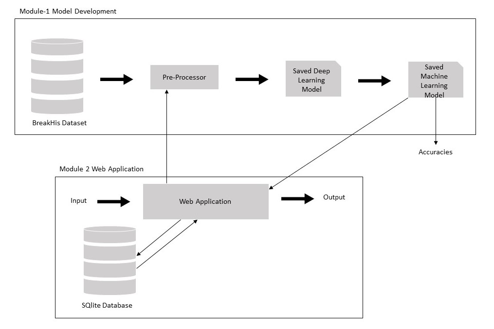
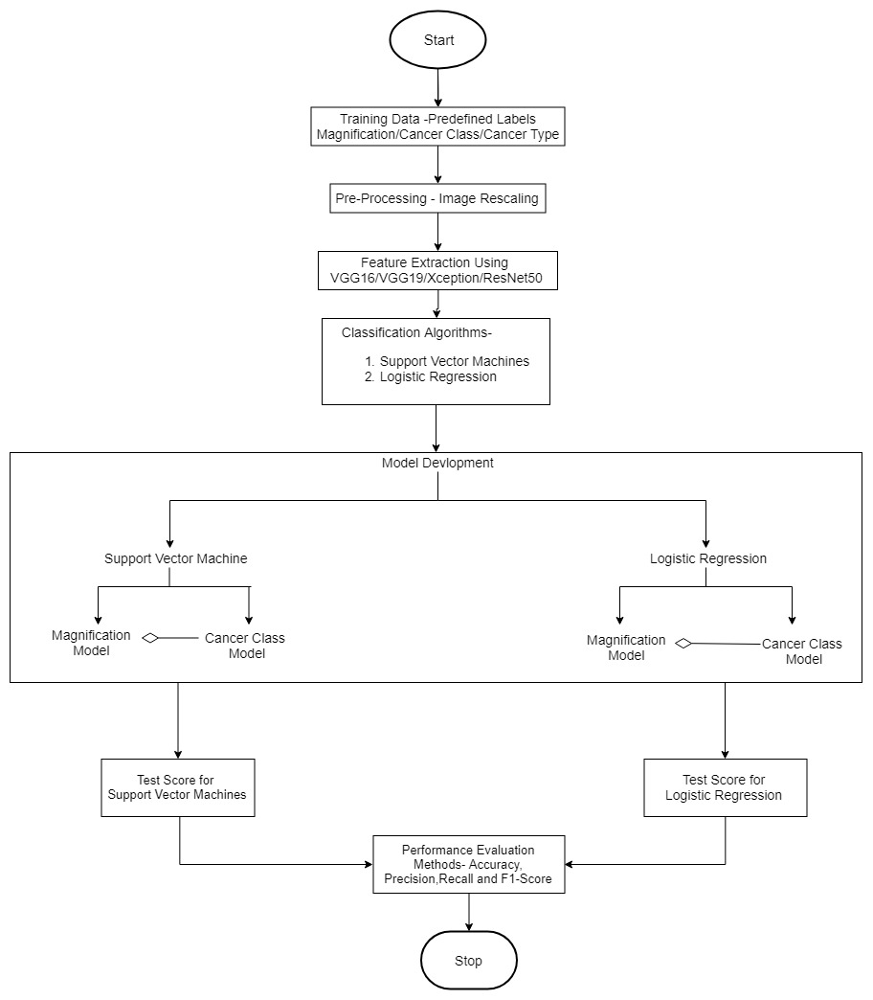

# Breast Cancer Diagnostics using Classification Algorithm

## Table of Content
* [Technology](#Technology)
* [Requirements](#Requirements)
  * [Library](#Requirements)
  * [System](#System)
* [Project Aim](#Project-Aim)
* [About Research Paper](#About-Research-Paper)
* [Platforms Used](#Platforms-Used)
* [System Setup](#System-Setup)
* [Workflow](#Workflow)
  * [Project](#Project-Workflow)
  * [Research Paper](#Research-Paper-Workflow)
* [Deployment](#Deployment)
* [Result](#Result)
  * [Project Result](#Project-Result)
  * [Research Paper Result](#Research-Paper-Result)
* [Future Work](#Future-Work)
* [Link To Document](#Document)

## Technology

The Above Project Uses Machine Learning and Deep Learning Algorithms in the Backend as Processing the Image and
in the frontend we have used Flask app for handling these Inputs

## Requirements
### Library
The Python Library required for running the project are- [Requirements](https://github.com/karangupta26/Breast-Cancer-Diagnostics-using-Classification-Algorithm/blob/master/Backend/Library%20Needed/requirements.txt)

    pip install -r requirements.txt

### System
#### Minimum Requirements

| Component       | Specification                                 |
| :-------------  | :-------------------------------------------  |
| Processor       | Core i5-5th Generation                        |
| RAM             | 8 GB- 16 GB                                   |
| HDD Space       | 30 GB                                         |
| GPU             | Nvidia 950M or above (Cuda and cuDNN Enabled) |        

#### Recommended Requirements

| Component       | Specification                                            |
| :-------------  | :------------------------------------------------------  |
| Processor       | Core i5-8th Generation                                   |
| RAM             | 8 GB- 16 GB                                              |
| HDD Space       | 30 GB                                                    |
| GPU             | Nvidia 1050Ti or above (Cuda and cuDNN Enabled)          |
|                 | or Nvidia Testla Family like K40, K80, P100, V100        |

The above Recommended GPU's or TPU's can be found on [Kaggle](https://www.kaggle.com/) or
[Google Colab](https://colab.research.google.com/)

## Project Aim
* To Study a Various Combinations of Classification Algorithms for Breast Cancer Diagnostics to Generate a WEB API.
* Use that Web API in Applications for the Analysis of Breast cancer histopathological images.

Some more suggestions were provide by [Mr. Tarry Singh](https://www.linkedin.com/in/tarrysingh/)

## About Research Paper
Simultaneously this Project was Documented as a Research Paper, under the Guidance of my project guide
[Ms. Nidhi Chawla](https://www.linkedin.com/in/nidhi-chawla-044a999b/). The Paper is published
in Procedia Computer Science Volume 167, Pages 878-889 entitled as-

[Analysis of Histopathological Images for Prediction of Breast Cancer Using Traditional Classifiers with Pre-Trained CNN](https://doi.org/10.1016/j.procs.2020.03.427)

<b>Abstract</b>- Breast cancer is one of the most commonly found and dangerous cancer among women which leads to a major research topic in medical science. Most of the times, it is identified by using a biopsy method where tissue is removed and studied under a microscope. If a histopathologist is not well trained then this may lead to the wrong diagnosis. In order to facilitate better diagnosis, automatic analysis of histopathology images can help pathologists to identify malignant tumors and cancer subtypes. Recently, Convolutional Neural Networks (CNNs) have become preferred deep learning approaches for breast cancer classification and detection. In this research, two machine learning approaches i.e. Support Vector Machine (SVM) and Logistic Regression (LR) are used for comparative analysis. This paper mainly focuses on leveraging pre-trained (CNN) activation features on traditional classifiers to perform automatic classification of breast cancer images. For this purpose, a two-phase model has been proposed for automatic classification on the basis of magnification subsequently classify the samples for benign and malignant. This model is trained separately with respect to various image magnifications (40x, 100x, 200x and 400x). In this study, the dataset is partitioned into the following fashion: 80% for the training phase and 20% for testing phase The performance is analyzed by using Accuracy, Precision, Recall and F1-score in order to find out the best-suited model that can be used for automation system. The experimental results demonstrate that ResNet50 network has achieved maximum accuracy for LR in comparison to SVM in magnification factor. In addition, results show that the performance of CNN + LR is slightly better than CNN +SVM for classification of benign and malignant classes. The proposed model helps in extracting more accurate image features and significantly improves the overall accuracy of classification.

## Platforms Used

In Whole Project we have used below mentioned platforms
* [Jupyter Lab](https://jupyter.org/)
  Used for excecuting Machine Learning Algorithms
* [Google Colab](https://colab.research.google.com/)
  Used for excecuting Deep Learning Algorithms
* [Atom Text Editor](https://atom.io/)
  Used For the devlopment of web apllication

## System Setup
    pip install -r requirements.txt

## Workflow

In this Project/Paper there two workflows
1. For Project in Which we will select best model on the basis on accuracy and then deploy in flask Application
2. Model Analysis on the basis of combination of Neural Networks and Classifiers. These Models are judged on the basis of Accuracy, Precision, Recall and F1-Value.

### Project Workflow

It has two workflows

1. **For Backend**

2. **System Design (Frontend+Backend)**

### Research Paper Workflow

## Deployment

## Result
### Project Result
### Research Paper Result

## Future Work

## Link To Document
